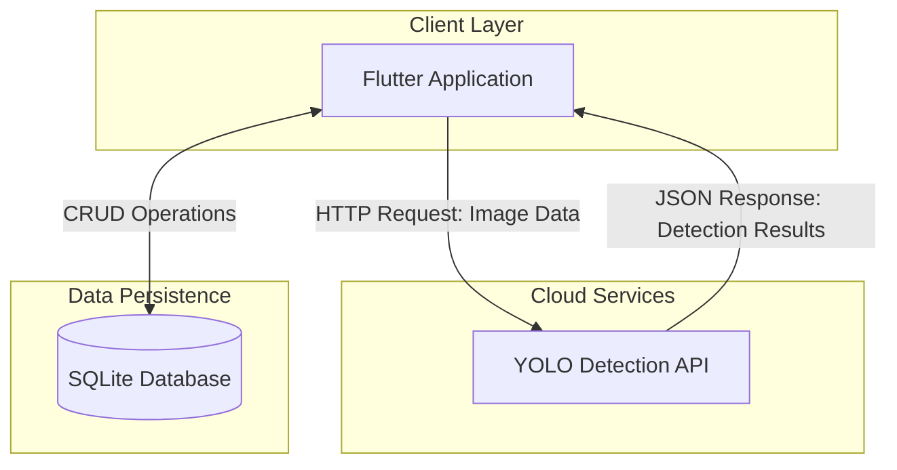

# FloraSign AI - Flower Recognition and Information App

FloraSign AI is a Flutter application that helps users recognize and learn about various flowers through photo capture and AI technology, including viewing birthday flowers and popular flowers information.

## Table of Contents

- [Demo Video](#demo-video)
- [System Overview](#system-overview)
- [Features](#features)
- [Tech Stack](#tech-stack)
- [Installation](#installation)
- [Usage](#usage)
- [Project Structure](#project-structure)

## Demo Video


[Demo Video Link](https://www.youtube.com/watch?v=oHkVxUplFMk)


## System Overview

FloraSign AI uses AI technology (YOLO Model) to detect and recognize flowers from photos. The system consists of:

- **Flutter Mobile App**: Cross-platform application for Android, iOS, Windows, macOS, Linux, and Web
- **YOLO Detection API**: Backend API on Hugging Face Space for flower detection
- **SQLite Database**: Local database for storing flower data and favorites

### Architecture Diagram



## Features

| Feature | Description |
|---------|-------------|
| 📷 **Photo Recognition** | Use camera to capture flower photos for AI identification |
| 🖼️ **Gallery Selection** | Select flower images from gallery to search |
| 🎂 **Birthday Flowers** | View flowers that match your birthday |
| 🌸 **Popular Flowers** | Browse popular flowers with their meanings |
| ❤️ **Favorites** | Save favorite flowers to view later |
| 📜 **Search History** | View history of previously captured flowers |
| 🎨 **Color Meanings** | Display flower meanings by color |

### Supported Flowers for Recognition

- 🌹 Rose
- 🌸 Carnation
- 🌺 Ixora
- 🌼 Gerbera
- 🪷 Lotus
- 💮 Globe Amaranth
- 🌷 Orchid
- 🤍 Gardenia Augusta

## Tech Stack

| Category | Technology |
|----------|------------|
| **Framework** | Flutter 3.x |
| **Language** | Dart |
| **State Management** | StatefulWidget |
| **Database** | SQLite (sqflite) |
| **Camera** | camera, image_picker |
| **HTTP Client** | http |
| **AI Model** | YOLO (via Hugging Face API) |
| **Local Storage** | shared_preferences |

## Installation

### Prerequisites

- Flutter SDK 3.9.2 or later
- Dart SDK
- Android Studio / Xcode (for mobile development)
- Visual Studio Code (recommended)

### Steps

1. **Clone Repository**
   ```bash
   git clone https://github.com/ParichatrSaipan/flower_AI.git
   cd flower_AI
   ```

2. **Install Dependencies**
   ```bash
   flutter pub get
   ```

3. **Run on Device/Emulator**
   ```bash
   # Android
   flutter run -d android
   ```

## Usage

### 1. Home Screen
When opening the app, you will find 4 main menu items:
- **📷 Take Photo** - Open camera to capture flower photos
- **🎂 Birthday Flowers** - View flowers for 7 days of the week
- **🌸 Popular Flowers** - Browse popular flower list
- **❤️ Favorites** - View saved flowers

### 2. Flower Recognition
1. Tap **Take Photo** or **Select from Gallery**
2. Capture the flower you want to identify
3. Tap **Confirm** to let AI analyze
4. The system will display results with flower information

### 3. View Flower Details
- Thai and English names
- Flower meanings by color
- Suitable occasions for giving flowers


## API Configuration

The app connects to YOLO Detection API on Hugging Face:

```
API Endpoint: https://cr2amx-flower-detector.hf.space/api/detect
Confidence Threshold: 60%
IOU Threshold: 45%
```

## Team Members

| Student ID | Name |
|------------|------|
| 66160106 | Manatsanan Kiatjakrawan |
| 66160152 | Parichatr Saipan |
| 66160176 | Anuwat Kaewsuk |

